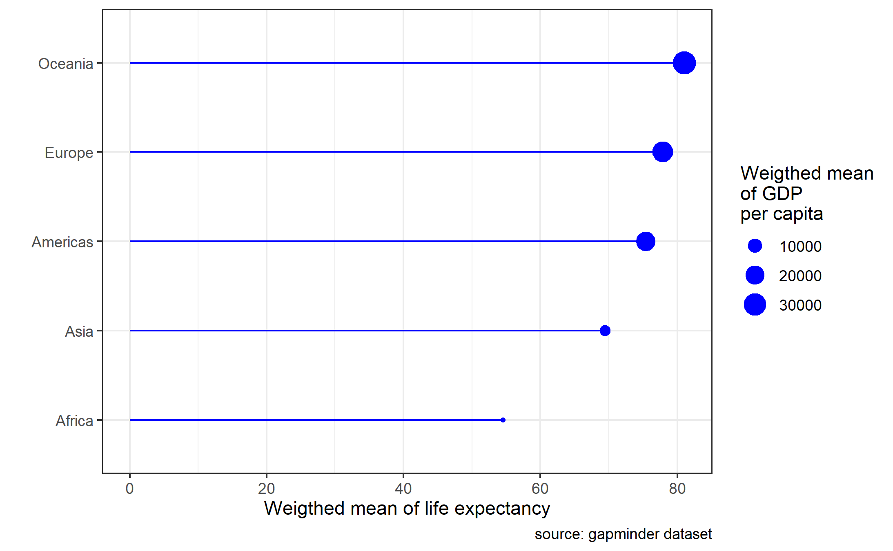
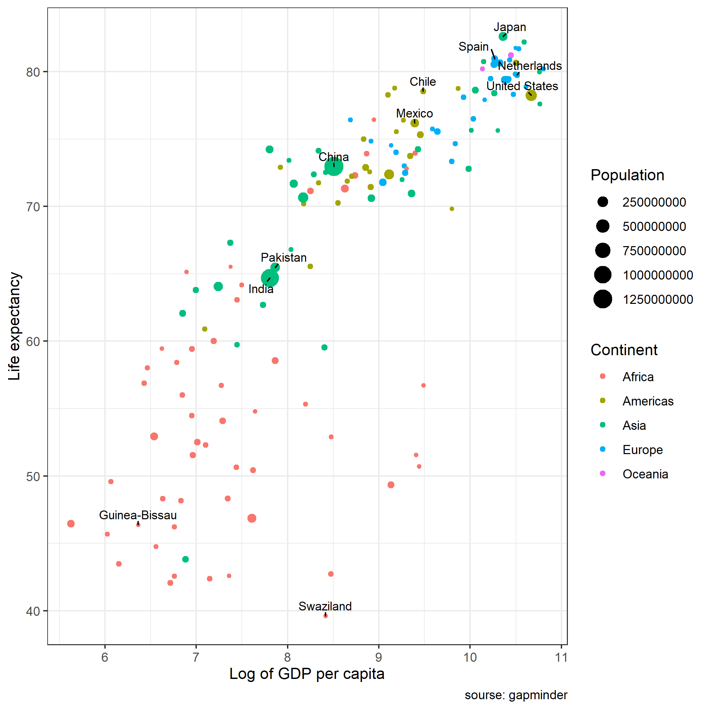

# Setup

In this module we use the tidyverse package to manipulate data frames. We will
also use the gapminder data set about global health and the library `ggrepel` to
prevent text overlap in our plots.

```{r message = FALSE, warning = FALSE}
library(gapminder)
library(ggrepel)
library(tidyverse)

data("gapminder")
```

We will remove scientific notation in printing with the following code:

```{r}
options(scipen = 999)
```


# A Short Introduction to dplyr

The package `dplyr`, like `ggplot2`, is part of the **tidyverse**. For a
complete list of tidyverse packages, see
[tidyverse.org/packages](https://www.tidyverse.org/packages/). `dplyr` allows
for data frame manipulations.

# The dplyr Verbs

There are 5 important dplyr **verbs**:

- `mutate()` creates new variables (columns) based on existing variables
- `select()` selects variables and also lets you rename them
(`select(new_name = existing_name)`)
- `filter()` selects observations (rows) based on a condition
- `summarise()` reduces (summarizes) certain groups into single values
- `arrange()` changes the order of the observations

Check out
[this useful tutorial](http://genomicsclass.github.io/book/pages/dplyr_tutorial.html)
to learn more.

# Data Summary

Let's start off by looking at the summary of the gapminder data set.

```{r}
summary(gapminder)
```

From the summary output, we can see that there are many countries
(1632 / 12 + 6 = 142), 5 continents and years from 1952 to 2007. There are also
variables for life expectancy, population and GDP per capita.

# A Line Plot

Suppose we want to make a line plot. The first thing to notice is that we have
too many countries to be plotted as individual lines in one plot. Therefore, as
a first plot, we would like to compare the development of life expectancy over
the years in the following countries: the Netherlands, Belgium, Germany, France
and the United Kingdom.

## Exercise 1—Creating a Line Plot

1. Create a vector `countries` of the aforementioned countries.

2. Create a data frame with the name `df1` based on the data frame `gapminder`
and select the rows of the countries of interest.

```{r}
countries <- c("Netherlands", "Belgium", "Germany", "France", "United Kingdom")

df1 <- gapminder %>%
  filter(country %in% countries)

head(df1)
```

Now we have a data frame with the name "df1" which contains 60 observations and
6 variables.

Let's now make a line plot of `df1` with year on the x-axis, `lifeExp` on the
y-axis and lines per country.

```{r}
df1 %>%
  ggplot(mapping = aes(x = year, y = lifeExp)) +
  geom_line(mapping = aes(color = country)) +
  labs(
    x = "",
    y = "Life Expectancy",
    color = "Country"
  ) +
  theme_bw()
```

# A More Complex Line Plot

Suppose we want to create a line plot with all countries depicted in gray except
for the Netherlands which we would like to color in red.

One way of doing that is to make a new column (which we call Netherlands) that
takes the value `1` if country equals the Netherlands and `0` otherwise.
Furthermore, we would like to have the new column as a factor (a categorical
variable to be able to use this column in the plot).

We need three things to achieve this:

1. The dplyr verb `mutate()`.
2. The function `ifelse()`.
3. The function `as.factor()` to convert the binary variable into a factor.

The `ifelse()` function tests a logical condition in its first argument. If the
test returns `TRUE`, `ifelse()` returns the second argument. If the test returns
`FALsE`, `ifelse()` returns the third argument.

An example:

```{r}
fruit <- "Apple"

ifelse(fruit == "Apple", "Correct!", "Wrong!")
ifelse(fruit == "Banana", "Correct!", "Wrong!")
```

We can use the command `as.factor()` around the `ifelse()` function. R will then
first exectute the inner part of the mutate verb (which is the ifelse
statement) and then make this variable a factor.

## Exercise 2—Creating a Highlighted Plot

1. Create a new data frame with the name `df2`.
2. Create a new variable with the name "netherlands" which contains a factor
with the level 1 if country is equal to the Netherlands and 0 otherwise.

```{r}
df2 <- df1 %>%
  mutate(netherlands = as.factor(ifelse(country == "Netherlands", 1, 0)))

df2
```

3. Now make a plot in which all countries have gray lines except for the
Netherlands which should be represented by a red line.

  *Hint 1*: Use `group = country` within the `aes()` function.
  
  *Hint 2*: You can change the colors with the function `scale_color_manual()`.
  
  *Hint 3* You can change the brightness of the lines by adding an aesthetic
  `alpha = netherlands` and then use
  `scale_alpha_manual(values = c("1" = 1, "0" = 0.3))` to control the
  transparency of the gray lines.

```{r}
df2 %>%
  ggplot(mapping = aes(x = year, y = lifeExp)) +
  geom_line(mapping = aes(group = country, color = netherlands)) +
  scale_color_manual(values = c("0" = "gray", "1" = "red")) +
  # Change opacity
  scale_alpha_manual(values = c("1" = 1, "0" = 0.3)) +
  labs(
    x = "",
    y = "Life Expectancy",
    color = "Netherlands"
  ) +
  theme_classic()
```

## Exercise 3—Practice with the Verbs `select()`, `filter()` and `arrange()`

1. Create a data frame with the name `df3` based on the data frame `gapminder`.

2. Select all columns which contain the letter "o" and the column "year".

  *Hint*: Check `?select` for help if needed.

3. Arrange `df3` using the variable `pop` from high to low.

4. Create a new column `rank` by adding a vector `1:length(country)`.

5. Filter the data frame so that you only keep the rows with a rank between 27
and 531.

```{r}
df3 <- gapminder %>%
  select(contains("o"), year) %>%
  arrange(desc(pop)) %>%
  mutate(rank = 1:length(country)) %>%
  filter(between(rank, 27, 531))

head(df3)
```

# The `summarise()` Function

The `summarise()` function creates summary statistics for a specific variable in
the data frame. For example, to compute the average life expectancy, apply the
`mean()` function to the column `lifeExp` using the `summarise()` function. The
call would look like the following:

`summarise(mean_lifeExp = mean(lifeExp))`

We can also compute these summary statistics per group. In our case the group
could be country (since we have multiple countries), year (since we have
multiple years) or continents.

Other summary statistics include:

- `sum()`
- `min()`
- `max()`
- `quantile()`
- `median()`
- `sd()`
- `n()` (length of a vector/variable) 
- `n_distinct()` (number of distinct values in a variable)

## Exercise 4—Summary Statistics

1. Create a data frame with the name `df4` based on `gapminder`.

2. Filter the observations to only show the year 2007.

3. Using `summarise()`, create a variable `mean_lifeExp` as the weighted mean of
life expectancy weighted by population per country and `mean_gdp` as the
weighted mean of GDP per capita weighted by population per country.

4. Arrange the data frame by the continents with the highest mean_gdp first.

```{r}
df4 <- gapminder %>%
  filter(year == 2007) %>%
  group_by(continent) %>%
  summarise(mean_lifeExp = weighted.mean(lifeExp, pop),
            mean_gdp = weighted.mean(gdpPercap, pop)) %>% 
  ungroup() %>%
  arrange(desc(mean_gdp))

head(df4)
```

## Exercise 4—Plot Weighted Mean of GDP per Capita

Re-create the following plot:



*Hint 1*: You may notice that despite the fact that we arranged the data in
`df4`, your plot has a different order than the example above. The `arrange()`
function does not carry over to plots. So in this case we have to re-order the
y-axis on the plot as well. Check out `?reorder`.

*Hint 2*: We have different layers in the plot. The first layer is
`geom_point()` and the other is `geom_segment()`. Check out `?geom_segment` for
the documentation.

```{r}
df4 %>%
  ggplot(mapping = aes(x = mean_lifeExp, y  = reorder(continent, mean_gdp))) +
  geom_point(
    mapping = aes(size = mean_gdp),
    color = "blue") +
  geom_segment(
    mapping = aes(x = 0, y = continent, xend = mean_lifeExp, yend = continent),
    color = "blue") +
  labs(
    x = "Weighted mean of life expectancy",
    y = "",
    caption = "source: gapminder dataset",
    size = "Weighted mean\nof GDP\nper capita"
  ) +
  theme_bw()
```

## Exercise 5—Plot Life Expectancy vs. Log of GDP per Capita

Re-create the following plot:



*Hint 1*: You could make 2 data frames: 1 with all countries without a label and
1 with countries with a label.

*Hint 2*: Use the `geom_poin()` function 2 times to in the plot.

*Hint 3*: The labels can be added with the package `ggrepel`.

```{r fig.height=6, fig.width=6}
df5 <- gapminder %>%
  filter(year == 2007) %>%
  mutate(logGDP = log(gdpPercap, base = 10))

df5_labels <- df5 %>%
  filter(country %in% c(
    "Switzerland",
    "Guinea-Bissau",
    "India",
    "Pakistan",
    "China",
    "Mexico",
    "United States",
    "Chile",
    "Netherlands",
    "Spain",
    "Japan"
    ))

ggplot(data = df5, mapping = aes(x = logGDP, y = lifeExp)) +
  geom_point(mapping = aes(color = continent, size = pop)) +
  geom_text_repel(data = df5_labels, mapping = aes(label = country)) +
  labs(
    x = "Log of GDP per capita",
    y = "Life expectancy",
    caption = "source: gapminder",
    size = "Population",
    color = "Continent"
  ) +
  theme_bw()
```


