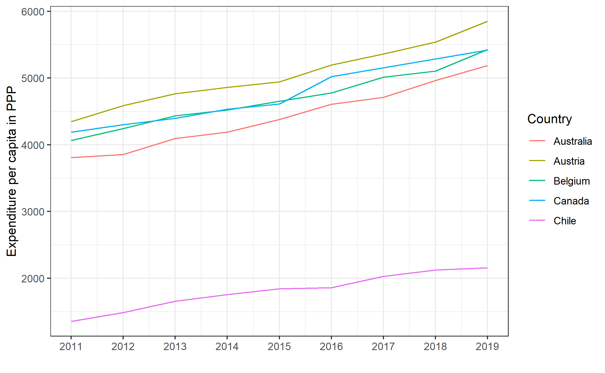
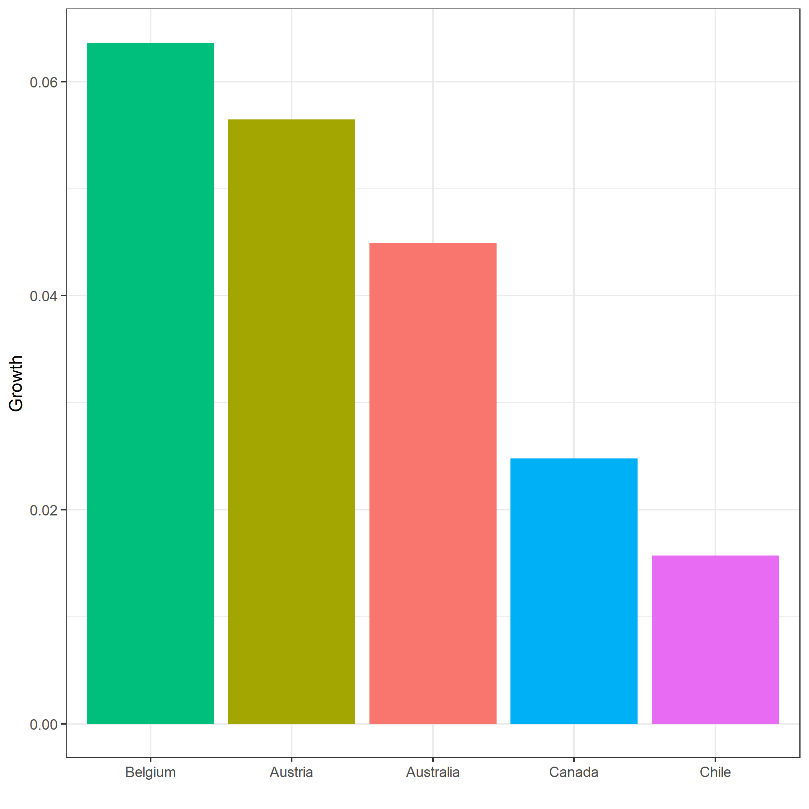

# Setup

In this module we use the tidyverse package to manipulate data frames.

```{r message = FALSE, warning = FALSE}
library(readxl)
library(tidyverse)
```

# Merging data

The following functions can be used to merge data:

- `merge()`
- `join()` (from the `dplyr` package)
- `rbind()` and `cbind()`

Let's construct some simple data frames to observe the effects of the different
merging commands.

```{r}
data1 <- data.frame(
  company = c("Apple", "Google", "Microsoft"),
  revenue = c(200, 100, 150),
  stringsAsFactors = FALSE
)

print(data1)
```

```{r}
data2 <- data.frame(
  company = c("Apple", "Google", "Tesla"),
  profit = c(150, 75, 120),
  stringsAsFactors = FALSE
)

print(data2)
```

The two data frames have 1 variable in common (`company`) and 1 different
variable each (`data1`: `revenue` and `data2`: `profit`). Furthermore, these
data frames have 2 observations in common (`Apple` and `Google`) and 1 different
observation each (`data1`: `Microsoft` and `data2`: `Tesla`).

Let's merge the two data frames.

## Merge Using `merge()`

```{r}
merged_data <- merge(data1, data2, by = "company")

merged_data
```

The `merge()` function only returns the companies that are part of both data
frames.

## Using the `dplyr`'s `join()` Command

The dplyr join commands makes it easier to control what happens.

```{r}
merged_data_full <- full_join(data1, data2, by = "company")

merged_data_full
```

When using `full_join()` all data points from both data frames are merged
together. Missing values will be represented by `NA`'s.

```{r}
merged_data_inner <- inner_join(data1, data2, by = "company")

merged_data_inner
```

The `inner_join()` function is comparable to the `merge()` command. It only
returns matching entries.

```{r}
merged_data_left <- left_join(data1, data2, by = "company")

merged_data_left
```

The `left_join()` function keeps all entries of the first data frame provided as
an argument in the function. Missing values will be represented by `NA`'s.

```{r}
merged_data_right <- right_join(data1, data2, by = "company")

merged_data_right
```

The `right_join()` function is similar to the `left_join()` function but keeps
all entries from the second provided data frame.

## Information about Missing Values

There are two functions that give information about the missing entries of the
merging data frames.

```{r}
merged_data_anti1 <- anti_join(data1, data2, by = "company")

merged_data_anti1
```

The `anti_join()` function returns the entries present in the first data frame provided but
not in the second data frame.

```{r}
merged_data_anti2 <- anti_join(data2, data1, by = "company")

merged_data_anti2
```

The order of the data frames matters.

```{r}
merged_data_semi1 <- semi_join(data1, data2, by = "company")

merged_data_semi1
```

The `semi_join()` function returns all entries that are present in both the
first and the second data frames. However, it only provides the columns of the
first data frame so it does not actually join the data frames.

```{r}
merged_data_semi2 <- semi_join(data2, data1, by = "company")

merged_data_semi2
```

Again, the order of the data frames matters.

## Binding Data Frames with `cbind()` and `rbind()`

The commands `cbind()` (column bind) and `rbind()` (row bind) are useful for
adding or concatenating data.

With `cbind()` you paste the data from the second data frame as new columns to
the first data frame. Note that `cbind()` does not match! Thus, the order of the
data is important.

Let's change the order of the second data frame to illustrate how the order of
the data in the data frames matter.

```{r}
data2a <- data2 %>%
  arrange(-profit)

data2a
```

And now let's try to use `cbind()`.

```{r}
bound_data1 <- cbind(data1, data2a)

bound_data1
```

With the `rbind()` function we paste the data of the second data frame after
the data of the first data frame. The second data frame must have the same
columns as the first data frame.

Let's create some new data to illustrate this how the column names matter.

```{r}
data1a <- data.frame(
  company = c("Netflix"),
  revenue = c(75),
  stringsAsFactors = FALSE
)

data1a
```

Now, let's try to paste the second data frame to the first one using `rbind()`.

```{r}
bound_data2 <- rbind(data1a, data1)

bound_data2
```

# Wide and Long Data Frames

Data frames come in long and wide forms. Let's explore them one-by-one.

## Transforming Data From Wide to Long Format

For this section, let's consider the current expenditure per capita in US dollar
purchasing power parity from the OECD Health Statistic 2021.

1. Read the sheet "Curr exp, per capita US$PPP" from the file
`OECD-Health-Statistics-2021-Frequently-Requested-Data.xls`.

  *Hint*: Use `skip` to discard the first rows and get the years as column headers

  *Hint*: R gives a warning indicating it will give names to unnamed columns and
add a prefix to columns with the same name.

2. Rename the column "..." to "country"`and the column "2019...51" to "2019".

  *Hint*: Put ` ` around column names containing only numbers, spaces etc. For
  example `2021`.
  
3. Select the columns 2011 to 2019.

4. Filter the first 5 rows of the data frame (i.e. Australia to Chile).

  *Hint*: You could use `filter()` but in this case `slice()` might be a good
  option.

```{r}
expenditure <- read_excel(
  path = "data/OECD-Health-Statistics-2021-Frequently-Requested-Data.xls",
  sheet = "Curr exp, per capita US$PPP",
  skip = 3
) %>%
  # Skip the last 6 rows
  filter(row_number() <= n() - 6) %>%
  # Remove the columns "...53" and "2019...54"
  select(-`...53`, -`2019...54`) %>%
  rename(country = "...1",
         `2019` = "2019...51") %>%
  select(country, `2011`:`2019`) %>%
  # Sort the data alphabetically by country
  arrange(country) %>%
  # slice(1:5)
  slice_head(n = 5)

# head(expenditure, n = 10)
expenditure
```

Now, we have 5 observations with 10 variables. Let's say we want to make the
following plot:



For that, it's easiest to first transform the data into the following format:

| country   | year | expenditure |
|-----------|------|-------------|
| Australia | 2011 | 3809.112    |
| Australia | 2012 | 3854.190    |

Then we could use ggplot with `x = year`, `y = expenditure` and
`color = country`.

We can transform the data from from its wide form to a long format with the
function `pivot_longer()`. The function accepts three arguments:

- `cols` specifying the columns that should be changed
- `names_to` indicating the name of the variable column
- `values_to` indicating the name of the values column

### Exercise 1—Data Frame Transformation to Long Format

Transform the data frame `expenditure` from a wide format to a long format
data frame `expenditure_long` with the columns `country`, `year` and
`expenditure`.

*Hint*: Remember to put backticks around number column names

```{r}
expenditure_long <- expenditure %>%
  pivot_longer(
    cols = `2011`:`2019`,
    names_to = "year",
    values_to = "expenditure"
  )

head(expenditure_long)
```

### Exercise 2—Plotting the Graph

Recreate the plot shown above.

*Hint 1*: You might get the following warning when plotting: "geom_path: Each
group consists of only one observation. Do you need to adjust the group
aesthetic?"
  
This means that R does not know how to connect the dots of `geom_point()`. The
reason for this is that the variable "year" is a character variable. You can
confirm this with `str(df2)`.
  
There are three ways to solve this problem:
  
  - Change the character variable to an integer with the following code:
  
    `expenditure_long$year <- as.integer(expenditure_long$year)`
    
  - Change the year to an integer within the `ggplot()` function like so
  
    `ggplot(..., aes(x = as.integer(year), y = expenditure, color = country))`
    
  - Add, as the warning suggests, `group = country` to the plot.
  
    `ggplot(..., aes(x = year, y = expenditure, group = country, color = country))`
    
*Hint 2*: Since the year variable is an integer, the numbers on the x-axis show
decimal places (e.g. 2012.5). We can to change this to a sequence of 2011 to
2019. You can do this by using the function: `scale_x_continuous()` with the
argument `breaks = seq(from = 2011, to = 2019, by = 1)`.
  
*Hint 3*: Don't forget to change the labels and set a theme for the plot.
  
```{r}
expenditure_long %>%
  ggplot(mapping = aes(x = as.integer(year), y = expenditure)) +
  geom_line(mapping = aes(color = country)) +
  scale_x_continuous(breaks = seq(from = 2011, to = 2019, by = 1)) +
  labs(
    x = "",
    y = "Expenditure per Capita in PPP",
    color = "Country"
  ) +
  theme_bw()
```

## Transforming Data From Long to Wide Format

Let's transform the data back into its wide form.

### Exercise 3a—Data Frame Transformation to Wide Format

Create a new data frame called `expenditure_wide` based on `expenditure_long`
with only the observations of the years 2018 and 2019.

```{r}
expenditure_wide <- expenditure_long %>%
  filter(year %in% c(2018, 2019))

head(expenditure_wide)
```

Suppose we would like to know the growth factor
($(\text{expenditure}_{2019} - \text{expenditure}_{2018}) / \text{expenditure}_{2018}$). For that, a data
frame in the wide format would be most useful:

| country   | 2018     | 2019     |
|-----------|----------|----------|
| Australia | 4793.460 | 3809.112 |
| Austria   | 5544.767 | 5705.102 |

We can use the function `pivot_wider()` to transform the data frame. The
function takes in two arguments:

- `names_from` indicating the variable or key column
- `values_from` indicating the column containing the values

### Exercise 3b—Data Frame Transformation to Wide Format

Make a new wide data frame `expenditure_wide` which follows the same format of
the table above.

```{r}
expenditure_wide <- expenditure_wide %>%
  pivot_wider(
    names_from = year,
    values_from = expenditure
  )

expenditure_wide
```

### Exercise 4—Growth Rates

Create a new column called "growth" based on the formula
($(2019 - 2018) / 2018$).

```{r}
expenditure_wide <- expenditure_wide %>%
  mutate(growth = (`2019` - `2018`) / `2018`)

expenditure_wide
```

### Exercise 5—Plotting Growth Rates

Recreate the following plot:



```{r}
expenditure_wide %>%
  ggplot(mapping = aes(x = reorder(country, -growth), y = growth)) +
  geom_col(mapping = aes(fill = country)) +
  labs(
    x = "",
    y = "Growth",
    fill = ""
  ) +
  guides(
    fill = "none"
  ) +
  theme_bw()
```
